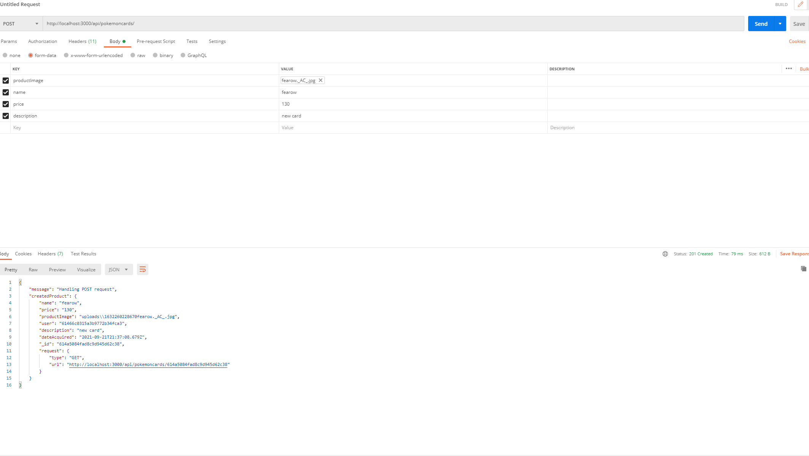
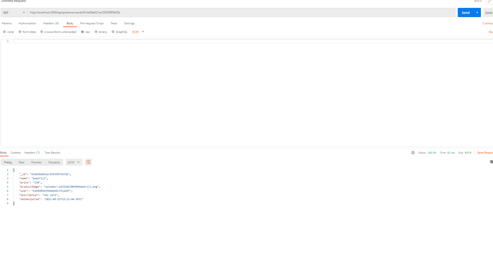

# Pokemon Card Image Repository
My project represents the backend of a site where users can sell their Pokemon cards.
It was created with Express and uses the following depedencies:

@hapi/joi for validation
bcryptjs for password hashing
chai for testing
dotenv for enviornment variables
jwt for web tokens
mocha for testing
mongodb, mongoose for the database 
multer for image uploading 
prettier for code formating

once the image is uploaded, the image can be accessed by using the file path provided in the productImage field. 

An example would be http://localhost:3000/uploads//1632075198556fearow._AC_.jpg

Users can register an account and login to begin selling their pokemon cards, where they must provide an image of the card, its name, and a price.
To start the program, run the command npm install then npm start
The routes are as follows:

/api/user/register

Route that allows a user to register. Requires a name, email and password.

/api/user/login

Route that allows a user to login. Requires a email and a password. Sends back the user's auth-token

/api/pokemoncards/

Post route that creates a new pokemon card. Requires a name, price, description, and an image file
Sends back a json of the newly created pokemon card

/api/pokemoncards/:pokemoncardId

Get route that sends back a json of the requested pokemon card. Requires the object id of the pokemon card

/api/pokemoncards/searchbyname/:name

Get route that sends back a json of all the pokemon cards that have that specific name. 

/api/pokemoncards/sortbyfield/:field

Get route that sends back a json of all the pokemon cards in the database, sorted by the provided field, Must also include a parameter for sorting order
in the body. 1 for sorting in decending order, and -1 for sorting in ascending order.

/api/pokemoncards/getusercards/:userId

Get all pokemon cards that belong to a specific user. Must pass in a valid User object id

/api/pokemoncards/:pokemoncardId

Delete route that deletes a pokemon card. Requires its specific object id to delete. Also only the user who created the pokemon card can delete it This route would be used if
the user wants to delete their pokemon card or it is sold successfuly.

/api/pokemoncards/:pokemoncardId

Patch route that modifies a pokemon card. Requires its specific object id to edit . Also only the user who created the pokemon card can edit it.

Here are some images of the routes in action:

